# ActiveStorage and AWS S3 buckets

AWS S3 buckets are used in this Rails application for two main purposes:

### File Uploads

The application uses ActiveStorage for file uploads. In the production environment, these files are stored in an AWS S3 bucket. This is configured in [config/storage.yml](https://github.com/danielpaul/RapidRails/blob/main/config/storage.yml) under the amazon service.

### Sitemap Storage

The application generates a sitemap for SEO purposes. In the production environment, this sitemap is stored in an AWS S3 bucket. This is configured in [config/sitemap.rb](https://github.com/danielpaul/RapidRails/blob/main/config/sitemap.rb).

## Setting up an AWS S3 bucket

Here is how to create and set up an AWS S3 bucket to use on your project:

1. Head over to [AWS](https://aws.amazon.com/s3/) and create an account.

2. Once you're logged in search for "S3" and click the "Buckets" option under the "S3" service.
    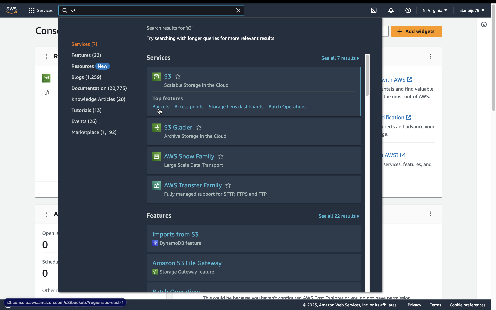

3. Next, click the "Create bucket" option.
    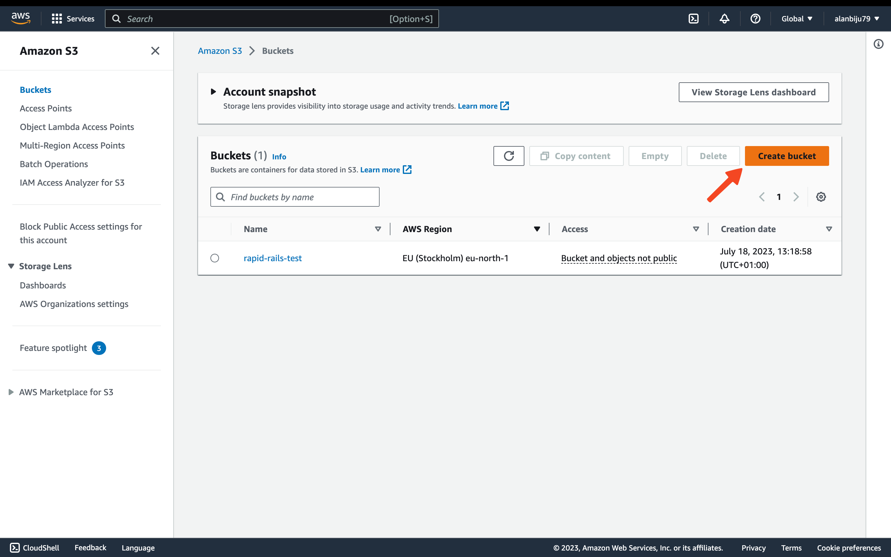

4. Fill in a bucket name, choose your region and then click the "Create bucket" button at the bottom of the screen.
    

5. Search for "Users" in the search bar and click the option shown below.
    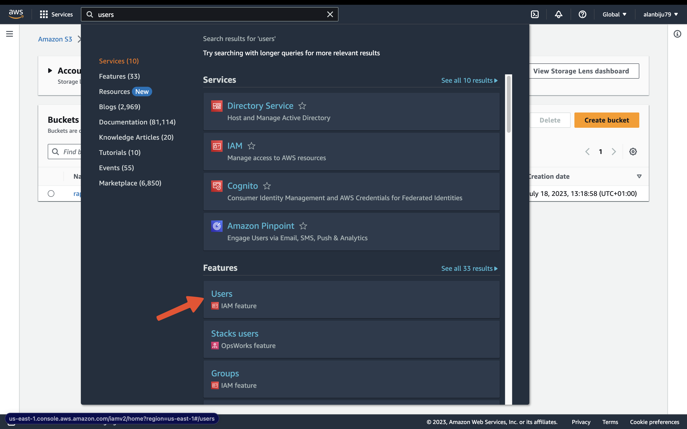

6. Click "Add users"
    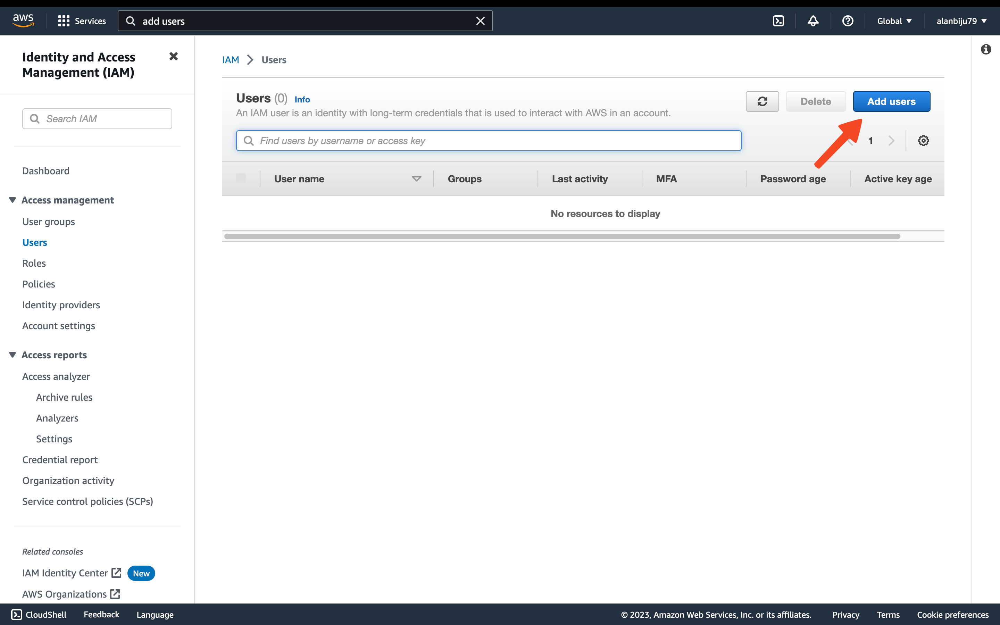

7. Enter a user name. Something like "active-storage-user" will do. Then hit the "Next" button.
    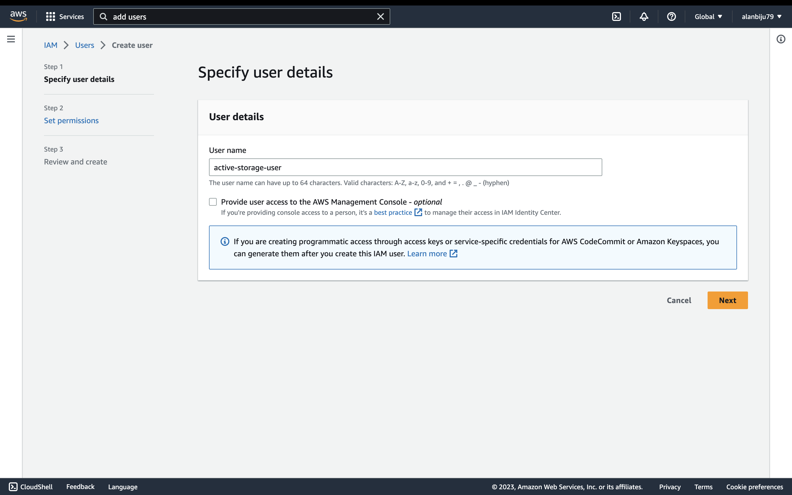

8. Click the "Attach policies directly" radio button. Then search for the policy named "AmazonS3FullAccess" and check the checkbox. Then hit the "Next" button.
    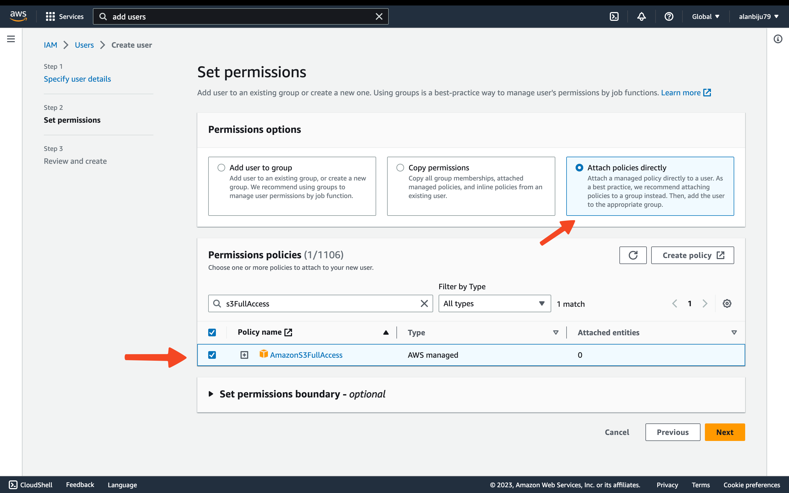

9. Finally click the "Create user" button.
    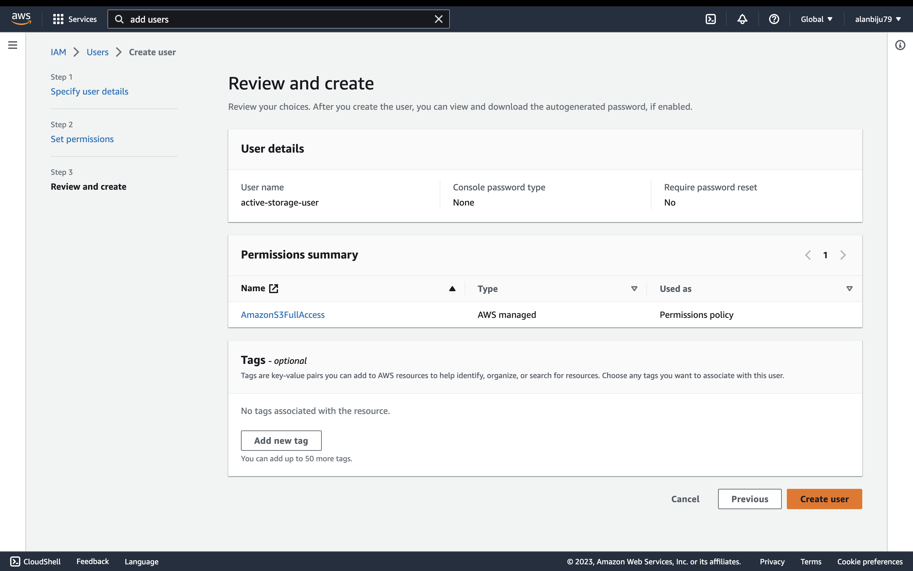

10. Now click on the user you just created.
    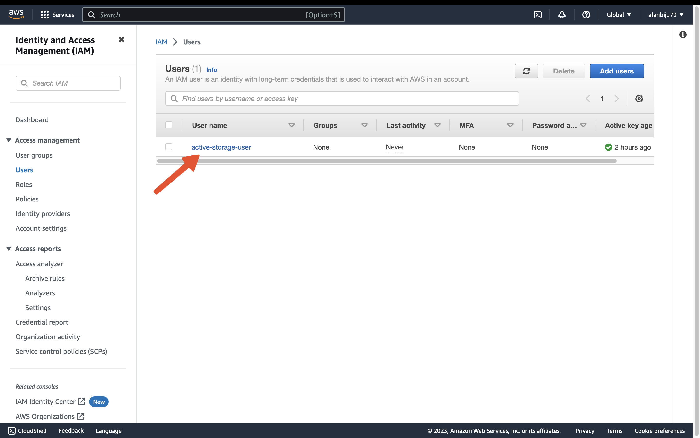

11. Select the "Security credentials" tab. Then scroll down on the page and and click "Create access key" button.
    
    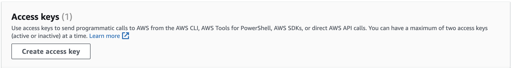

12. Select "Other" and click the "Next" button.
    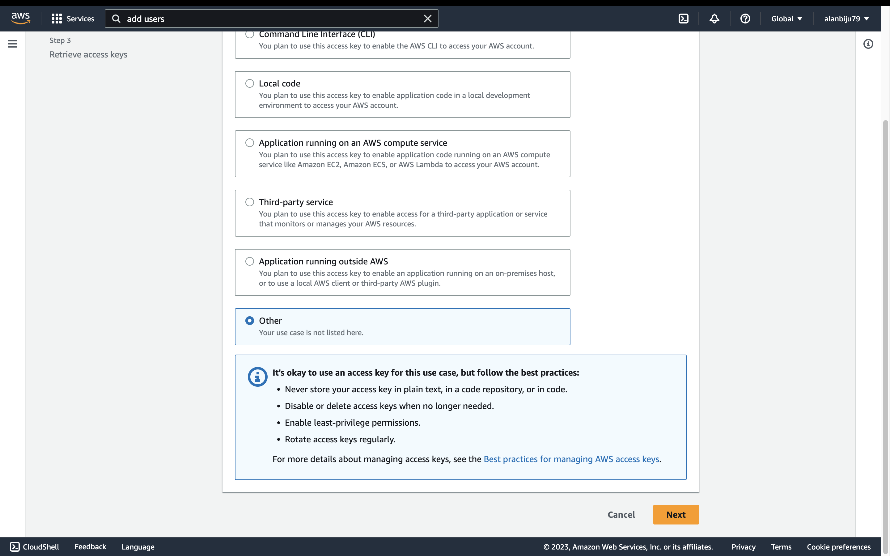

13. After the access key is created you'll be shown the page below. Copy both the access keys.
    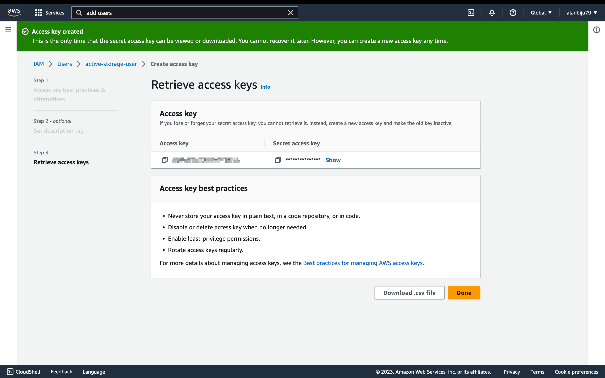

14. Open your `credentials.yml` file add fill in the options shown below with your own credentials.
    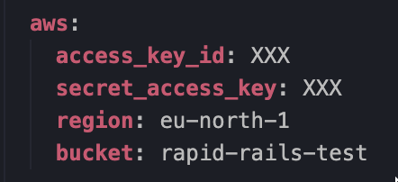

Your AWS S3 bucket is now configured to use with your application. More information about AWS S3 can be found on the [AWS S3 website](https://aws.amazon.com/s3/).
