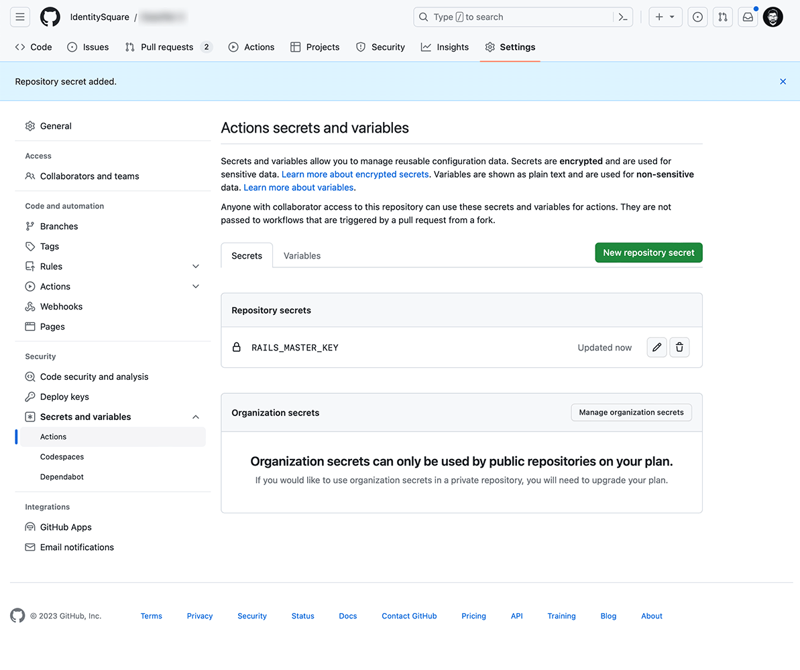

# Automated Testing and Github CI

## Automated Testing

We use [Rspec](https://github.com/rspec/rspec-rails) for automated testing in our codebase. All Rspec tests reside in the [spec](../spec) folder.

### FactoryBot

[FactoryBot](https://github.com/thoughtbot/factory_bot_rails) is a gem we use primarily in automated testing to easily generate records with randomized data. Factories for the different models can be found at [spec/factories](../spec/factories). For more information refer to [this guide](https://thoughtbot.github.io/factory_bot).

## CI

[Github Actions](https://docs.github.com/en/actions) is used as our workflow configuration and takes care of CI. Our workflow file is [rubyonrails.yml](../.github/workflows/rubyonrails.yml).

To ensure that the Rspec tests run smoothly in the Github Actions workflow, it is important to save your Rails master key in the Actions secret and variables settings on Github.

Refer to this [documentation](https://docs.github.com/en/actions/using-workflows/workflow-syntax-for-github-actions) to learn more about the workflow syntax.

We also use [Dependabot](https://github.com/dependabot) for automated dependency updates. Our config file for dependabot is [dependabot.yml](../.github/dependabot.yml). For further info about configuration refer to [this guide](https://docs.github.com/en/code-security/dependabot/dependabot-version-updates/configuration-options-for-the-dependabot.yml-file).
