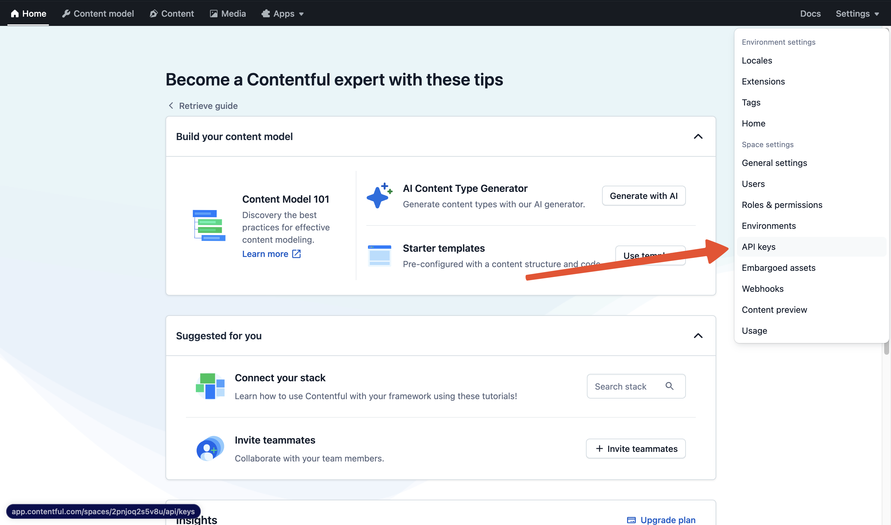
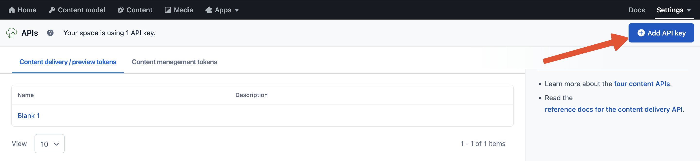
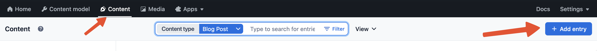
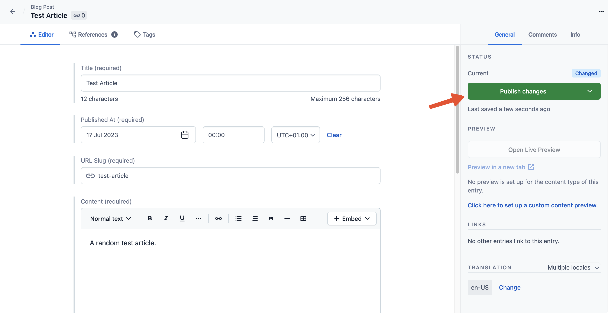

# Blog

We use Contentful (free plan) to manage blog posts but can use Contentful for other content types as well. The structure is already setup with webhooks and caching, and everything is ready to go.

To create your own blog:

1. Sign Up to [Contentful](https://www.contentful.com/sign-up/) to create a free account.

2. From the settings dropdown on the top right, select "API keys".
   

3. Click the "Add API key" button.
   

4. Copy the "Space ID", "Content Delivery API - access token" and "Content Preview API - access token" and paste them into your `credentials.yml` file.
   

5. Install the [Contentful CLI](https://www.contentful.com/developers/docs/tutorials/cli/installation/) & login with `contentful login`.

6. Import our sample model structure to the space.

```
contentful space import --space-id <space_id> --content-file lib/templates/contentful.json
```

7. Update the Webhook's domain & webhook secret key in the webhook settings page. Add a secret header named `Authorization:Bearer` and set your own password in the Contentful dashboard and in our credentials file.

8. Click the "Content" tab on the topbar and then the "Add entry" button on the top right hand side.
   

9. Then simply fill in the fields and hit "Publish changes".
   

10. Visit `http://localhost:3000/blog` and ta-da! Your blog is all set up!
