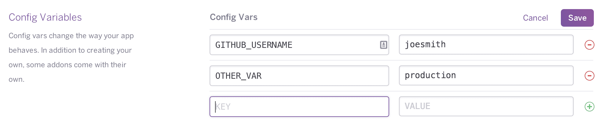

# App Deploy

## GitHub Actions

We use Github Actions as our workflow configuration and takes care of CI.
For GitHub Actions to work, it is important to save your Rails master key in the Actions secret and variables settings on Github.

Set `RAILS_MASTER_KEY` in the secrets section of your repository settings on Github.

## Deploy without heroku

Setup any environment variables that need to be added to production after deploy depending on the environment of the server.
Setup **Sidekiq**, **Redis**, **Postgres** and a **Task Scheduler** as we will need them to run our application.

## Heroku Setup

### Automatic Deploy

Refer to this [guide](https://devcenter.heroku.com/articles/github-integration) to link your github codebase to Heroku and setup automatic deploys.

### Manual Deploy

Install [Heroku CLI](https://toolbelt.heroku.com/) and login to Heroku account (`heroku login`).

Create your heroku app and deploy your **master** branch. You may also use the CLI to deploy your app:

1. `heroku git:remote -a example-app` where **example-app** is the name of your app on heroku.
2. `git push heroku main`

Setup these addons:

- Heroku Postgres addon
- Redis addon
- Heroku Scheduler addon

Setup Buildpacks:

- `heroku buildpacks:set heroku/ruby -a <app_name>`

## Render Setup

### Automatic Deploy

Deploy with a render.yaml file that helps Render pre-configure the application.

### Manual Deploy

1. Create a new Web Service on [Render](https://render.com)
2. Connect your GitHub repository
3. Configure the following settings:
   - **Build Command:** `bundle install`
   - **Start Command:** `bundle exec puma -C config/puma.rb`
   - **Environment:** `production`

### Required Services for Render

Create these additional services in Render:

- **PostgreSQL Database** - Create a new PostgreSQL database
- **Redis** - Create a new Redis instance for caching and Sidekiq
- **Background Worker** - Create a new Background Worker with start command: `bundle exec sidekiq -C config/sidekiq.yml`

### Render Cron Jobs

Configure these cron jobs in Render:

- `bundle exec rake active_storage:purge_unattached_blobs` - Run daily
- `bundle exec rake anonymize:users` - Run daily  
- `bundle exec rake sitemap:refresh` - Run daily

## Default Config variables setup

Set these config variables on your cloud platform:

- Set `RAILS_MASTER_KEY` config var to decrypt `credentials.yml.enc` file
- Set `HOST` config var to your domain
- Set `RAILS_ENV` config var to `production`

Refer to [this guide](https://devcenter.heroku.com/articles/config-vars) to setup config vars on Heroku.

## Heroku extensions setup

- To ensure proper functionality of Sentry's release detection with Heroku, it is important to run the following command: `heroku labs:enable runtime-dyno-metadata -a <app name>`.

## Contentful setup

If using contenful for your blogs, setup the webhook to call your production server for clearing cache. `https://<HOST>/contentful/webhook` with the secret token (Header as `Authorization:Bearer`) that is set in the credentials file.

# Rake tasks

Add these default take tasks to your scheduler on production.

- `rake active_storage:purge_unattached_blobs` to purge unattached file that are older than 2 days in active storage. - Run once a day.
- `rake anonymize:users` to anonymize users data. - Run once a day. Important to delete user's data in our database. Give's time for them to change their mind before we delete their data.
- `rake sitemap:refresh` to refresh sitemap. - Run once a day.

# Database setup

Run rails `db:prepare` on production after deploy to set up your database if it does not exist and apply migrations.

# Redis Setup

Redis, setup eviction policy to `allkeys-lru` to ensure that the cache is cleared when the memory limit is reached. Run this command to set the eviction policy:

`heroku redis:maxmemory REDIS --policy allkeys-lru -a example-app`

Without this, Redis will not clear the cache and will throw an error when the memory limit is reached.
