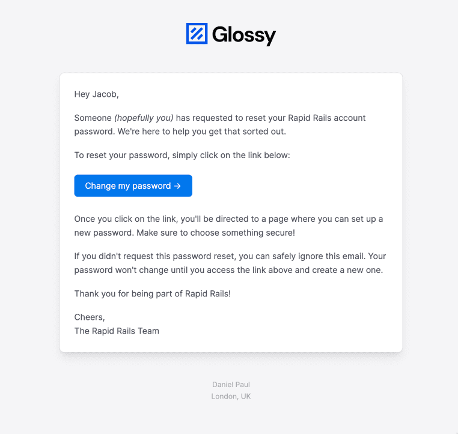
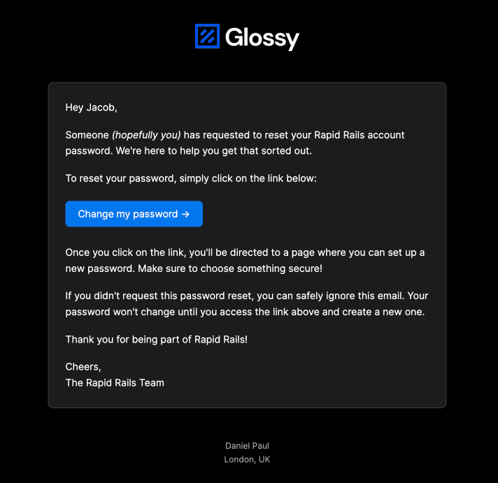

# Emails

## Local Development

All emails sent from development are automatically opened in the browser by `letter_opener` gem.

## Email Styles

RapidRails has a mailer layout (based on [Postmark's templates](https://github.com/ActiveCampaign/postmark-templates)) that supports both light and dark mode based on system settings.

| Light                                 | Dark                                |
| ------------------------------------- | ----------------------------------- |
|  |  |

### CTA button

To use the email's call to action button styling, render the partial [\_cta_button.html.haml](../app/views/layouts/mailer/_cta_button.html.haml) to keep the buttons consistant across all emails.

```
= render 'layouts/mailer/cta_button', text: 'Example Button', url: root_path
```

## Email Delivery in production

RapidRails is setup to use [Postmark](https://postmarkapp.com/) to deliver emails in production.

The only config that needs to be setup is to store your postmark `api_token` in rails production credentials. You can get your `api_token` by signing up on the [Postmark website](https://postmarkapp.com/) for an account.

If you'd like to use a different mail delivery service, you can change the `config.action_mailer.delivery_method` in [production.rb](../config/environments/production.rb) to the service of your choice and add any additional config required by the new service like setting the API keys. Remove `config.action_mailer.postmark_settings` as it won't be required anymore.
