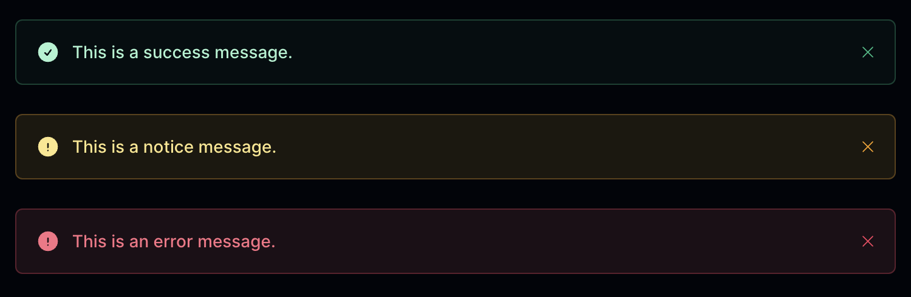
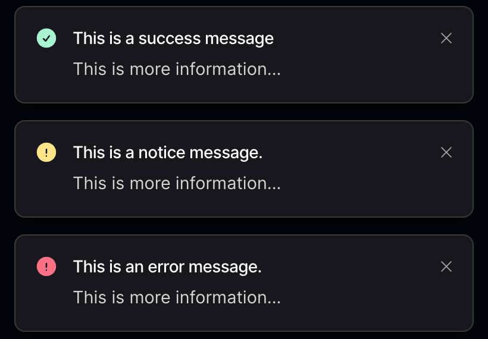

# Flash Messages

There are two types of flash messages that are available to use with RapidRails:

## FlashMessagesComponent

The [FlashMessagesComponent](https://github.com/danielpaul/RapidRails/blob/main/app/views/components/flash_messages_component.rb) is used to render a flash message at the top of the page.

Here's an example of how to use this method:

```
flash.now[:success] = "This is a success message."
flash.now[:notice] = "This is a notice message."
flash.now[:error] = "This is an error message."
```



## FlashToastComponent

The [FlashToastComponent](https://github.com/danielpaul/RapidRails/blob/main/app/views/components/flash_toast_component.rb) is used to render flash messages as toast notifications. There is a `flash_message` [method](https://github.com/danielpaul/RapidRails/blob/main/app/helpers/flash_helper.rb) that can be used to create these.

```
def flash_message(type, heading, body = nil, now: false)
```

This method takes four parameters:
- `type` (required): `:success`, `:notice` or `:error`
- `heading` (required): The heading of the message. 
- `body` (optional): The body of the message.
- `now` (optional): Determines if the message should be rendered immediately.

Example uses:

```
flash_message(:success, "This is a success message", "This is more information...", now: true)
flash_message(:notice, "This is a notice message", "This is more information...")
flash_message(:error, "This is an error message")
```


