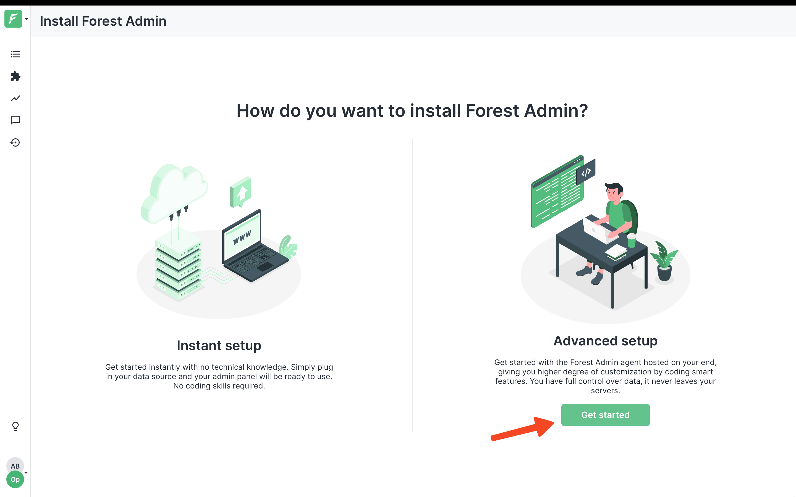
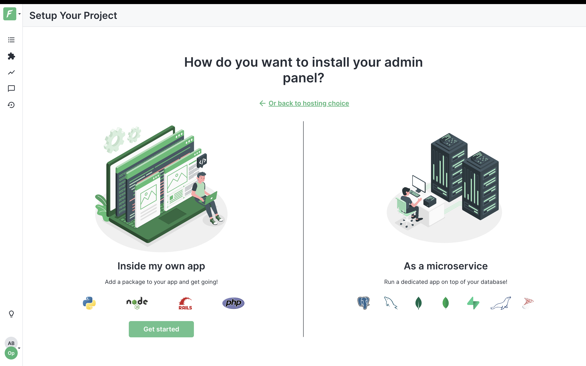
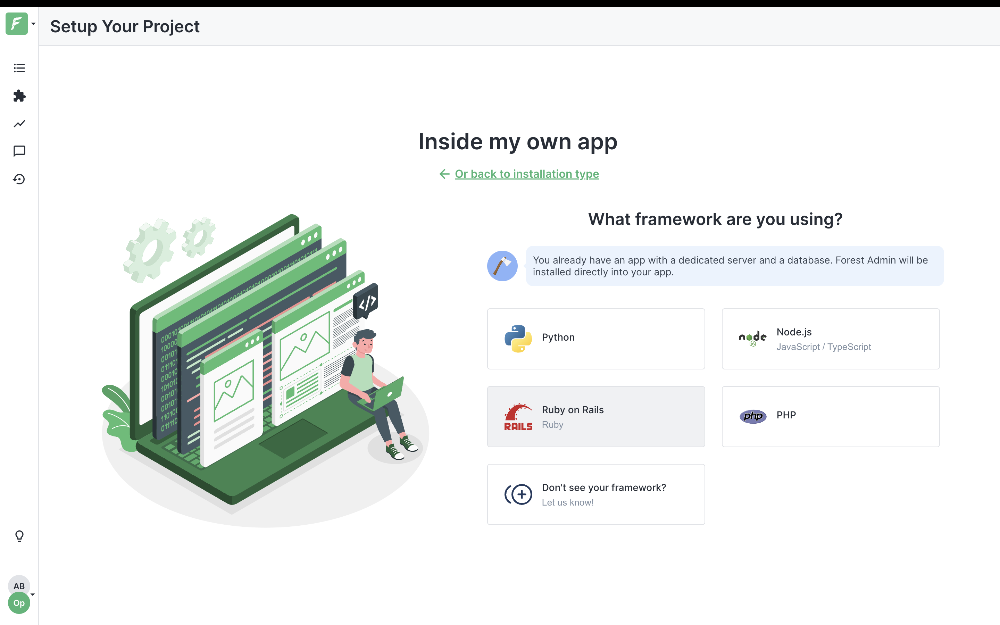
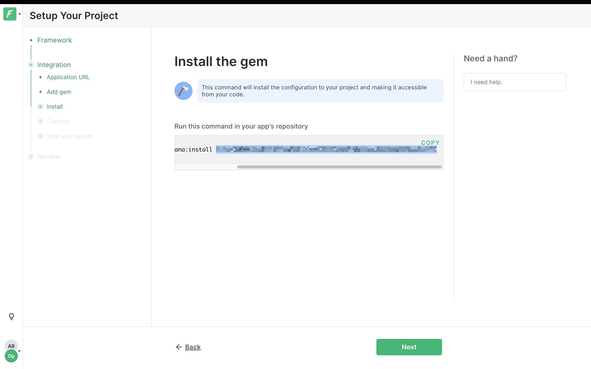

# Admin with Forest Admin

We use [Forest Admin](https://www.forestadmin.com/) as the admin panel for our data. We have a lot of things setup for you to start using Forest Admin staright away.

You can configure Forest Admin for your project as follows:

1. Head over to [Forest Admin](https://www.forestadmin.com/)  and create a free account.

2. Once you're logged in you will be brought to a dashboard page. Click the "Get started" button on the "Advanced setup" side.
    

3. Next hit "Get started" in the "Inside my own app" side" of the page.
    

4. Next select "Ruby on Rails" as the framework you are using.
    

5. Now you'll enter a configuration wizard. Click thorugh the wizard until your reach the "Install" page. Copy only the env secret key and paste this in your `credentials.yml` as your forest_admin env_secret.
    

6. Run `rails dev:cache` in your terminal inside your project directory.

7. Complete the wizard and run `bin/dev`. Ta-da 🥳. All done. You will now see your admin panel on Forest Admin.

For more information about configuration and customization see the [Forest Admin documentation](https://docs.forestadmin.com/documentation/).
 