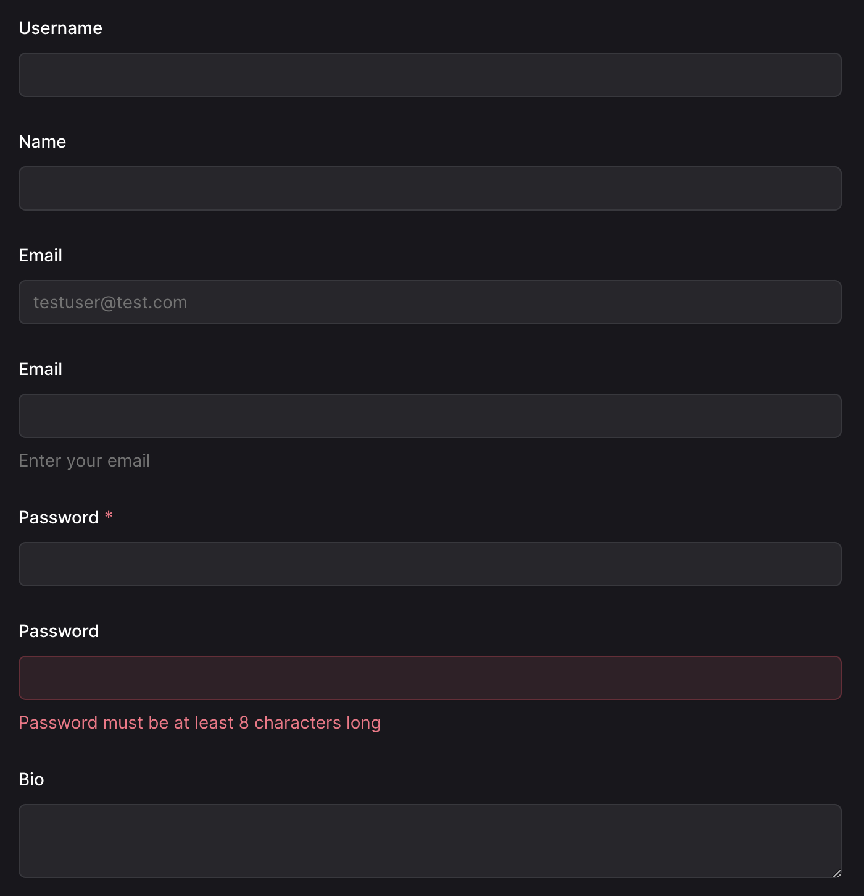
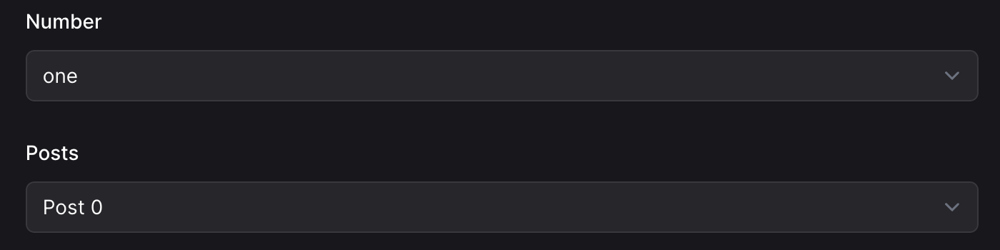
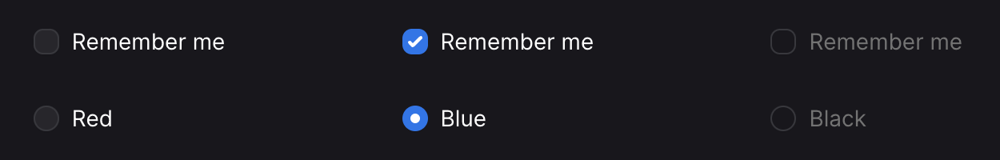

# Forms

Our [RapidRailsFormBuilder](https://github.com/danielpaul/RapidRails/blob/main/app/helpers/rapid_rails_form_builder.rb) is a custom form builder class, built on top of the default Rails form builder, that provides additional functionality and customization for form fields. If you do not want to use RapidRailsFormBuilder, you can always use Rails' default form builder and style it yourself.

## Usage

To use this form builder, you need to specify it when using the form_with or form_for helper in your views:

> `= form_for :something, method: :post, builder: RapidRailsFormBuilder do |form|`

To show form errors render the `FormErrorsComponent` inside the form as follows:

> `= form_for(resource, as: resource_name, url: registration_path(resource_name), builder: RapidRailsFormBuilder`  
> &nbsp;&nbsp;&nbsp;&nbsp;`= render FormErrorsComponent.new(resource)`

## Fields

All the [Action View Form Helper](https://guides.rubyonrails.org/form_helpers.html#helpers-for-generating-form-elements) methods work with RapidRails form builder. Here are some examples:

### **text_field, email_field, password_field, text_area etc.**

These methods create text-like fields. Here are some examples:

> `= form.text_field :username`

> `= form.text_field :username, label: "Name"`

> `= form.email_field :email, placeholder: "testuser@test.com"`

> `= form.email_field :email, hint: "Enter your email"`

> `= form.password_field :password, required: true`

> `= form.password_field :password, error: "Password must be at least 8 characters long"`

> `= form.text_area :bio`

### **submit and button**

These methods create buttons. Here are some examples:

> `= form.button 'Cancel'`

> `= form.button 'Cancel', disabled: true`

> `= form.submit 'Submit'`

### **select and collection_select**

These methods create select fields.

> `= form.select :number, {"one": 1, "two": 2}`

> `= form.collection_select :posts, Post.all, :id, :title`

### **check_box and radio_button**

These methods create checkbox and radio button fields. Here are some examples:

> `= form.check_box :remember_me`

> `= form.check_box :remember_me, checked: true`

> `= form.check_box :remember_me, disabled: true`

> `= form.radio_button :colour, "red", label: "Red"`

> `= form.radio_button :colour, "blue",  label: "Blue", checked: true`

> `= form.radio_button :colour, "black", label: "Black", disabled: true`

## Styling

The `RapidRailsFormBuilder` adds default classes to the form fields for styling. You can override these classes by specifying the `:class` option. If you would like to change the default styling for all form fields, you can do so by editing the [RapidRailsFormBuilder](https://github.com/danielpaul/RapidRails/blob/main/app/helpers/rapid_rails_form_builder.rb)

The [FormErrorsComponent](https://github.com/danielpaul/RapidRails/blob/main/app/views/components/form_errors_component.rb) can also be edited to change the default styling for form errors.

Form classes are located in the [application.tailwind.css](https://github.com/danielpaul/RapidRails/blob/main/app/assets/stylesheets/application.tailwind.css) file and can be customized by editing the classes.
