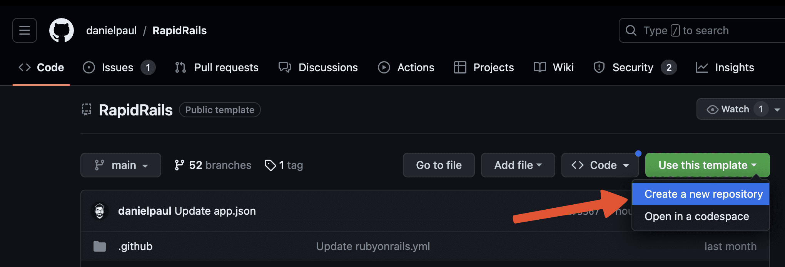
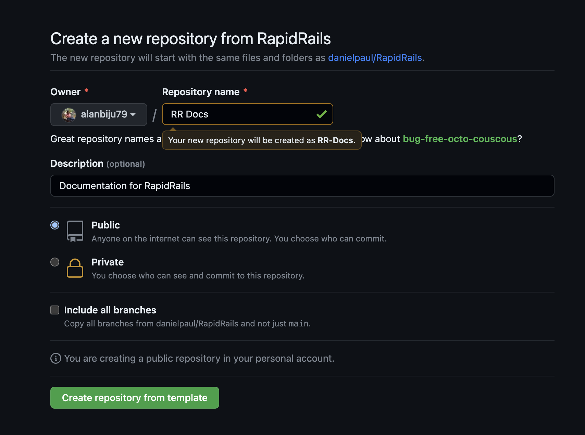

# Getting Started

Let's get started with your new Rails project! This documentation should help you understand how RapidRails is built and help you configure all the features and start building.

1. Visit the [RapidRails Github](https://github.com/danielpaul/RapidRails).

2. Click the **Use this template** button and select **Create a new repository**.

   

3. Fill out the fields and click the **Create repository from template** button.

   

4. Clone the repository to your local machine.

5. Navigate to the repository on your terminal and run `bin/setup`.

6. Follow the prompts from the setup script to configure your application. You can read more about the setup script and configuration in the next section.

7. Then simply start your server by running `bin/dev`. 
    
    And... thats it! You're all set to go! 🎉
