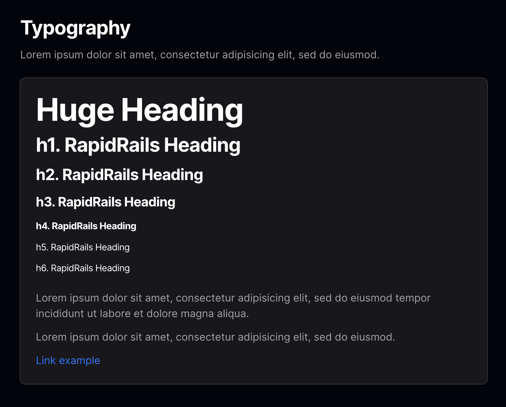
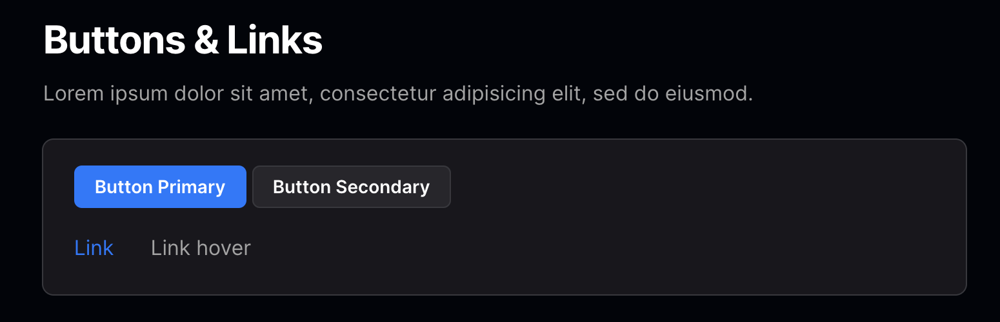
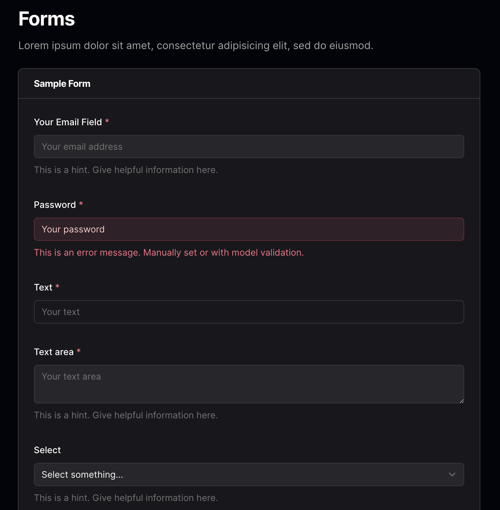
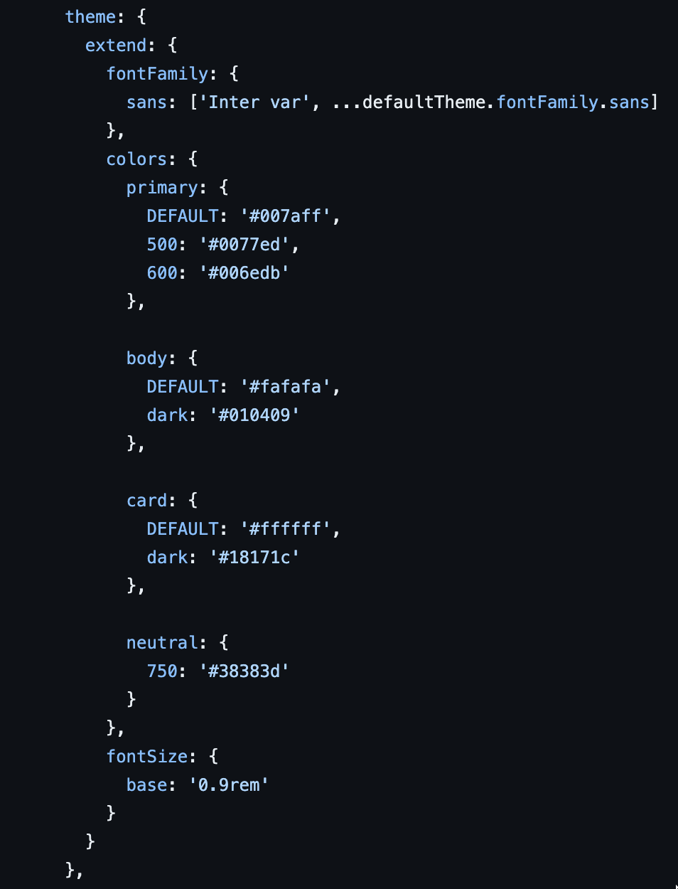

# Styling with Tailwind CSS in RapidRails

In RapidRails, we use [Tailwind CSS](https://tailwindcss.com/docs) for styling. Tailwind is a utility-first CSS framework that provides low-level utility classes to build custom designs.

## Customising Styles

RapidRails, includes components for cards, links and buttons. These classes are defined in the [application.tailwind.css](https://github.com/danielpaul/RapidRails/blob/main/app/assets/stylesheets/application.tailwind.css) file.

You can find more examples of styled UI elements [here](https://github.com/danielpaul/RapidRails/blob/main/app/views/dashboard/index.html.haml).

## Tailwind CSS in Forms

We use a custom form builder [RapidRailsFormBuilder](https://github.com/danielpaul/RapidRails/blob/main/app/helpers/rapid_rails_form_builder.rb) that adds default classes to form fields for styling. You can read more about this in our [forms documentation]().

## Colors and Fonts

The [tailwind.config.js](https://github.com/danielpaul/RapidRails/blob/main/config/tailwind.config.js) can be used to customise the theme, add plugins, and specify the files that Tailwind should scan for class usage. You can also modify the colors for various UI elements in this file.

Here you can edit the primary accent colors used by the application, the body color for the application, the color of cards and change the base font size throughout the application.

For more information see the official [Tailwind Configuration Docs](https://tailwindcss.com/docs/configuration).
