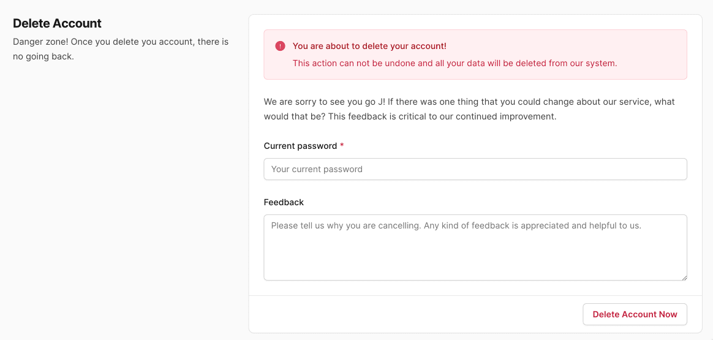

# User Deletion

In it's default setup, deleting a user account revokes their access to the application and soft-deletes the User record. We use the [discard](https://github.com/jhawthorn/discard) gem to soft-delete records across the application.

A signed in user can delete their account via the **Account Settings**. They may enter optional feedback which is stored as a new [UserAccountFeedback](../app/models/user_account_feedback.rb) record.

Depending on the way your app would like to handle user deletion, you can setup your app for any of the following or write your own flow:

1. Soft-delete (default)
2. Soft-delete and anonymization
3. Permanentaly delete the user record

## 1. Soft-delete (default)

The default flow soft-deletes the User record and sign them out.

## Soft-delete and anonymization

We have a task `rake anonymize:users` that anonymizes user records after a period of time. This task calls [AnonymizationService](../app/services/anonymization_service.rb) which strips all columns of the user's data.

1. Running `rake anonymize:users` anonymizes user records that were discarded a certain number of days ago and have not been anonymized yet. The number of days is stored in a constant called [ANONYMIZE_USER_DATA_AFTER_DAYS](../config/initializers/0_constants.rb) which if set to **0** will anonymize the user record immediately (when the rake task runs). The rake task should be setup on your cloud platform to run periodically if needed.
2. Some fields are set to custom values. For example, `full_name` to **"Deleted User"**, `email` to **"prefix@domain"** where **prefix** and **domain** are customizable and password is set to a secure 60 character **SecureRandom** password.

### IMPORTANT:

If using the anonymizer and if any new attributes are added to the **User** record, don't forget to update the method `anonymize_user` in [AnonymizationService](../app/services/anonymization_service.rb) to clear or randomize the new attributes.

## Permanentaly delete the user record

If you'd like to permanentaly delete a user record, replace `discard` with `destroy` wherever it is called on a **User** record. The main location where this needs to be replaced is [registrations_controller.rb](../app/controllers/registrations_controller.rb) in the **destroy** action.
